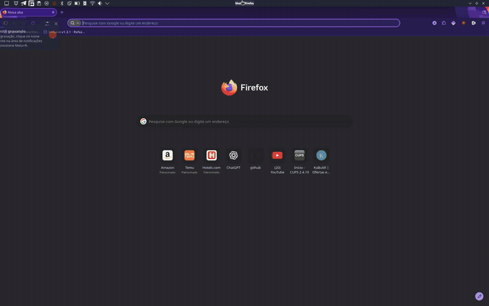

# Plasma Title & Buttons

> 🌐 **Idioma / Language**: [Read in English (README.en.md)](README.en.md)

Um applet (plasmoid) elegante e altamente configurável para o painel do **KDE Plasma 6**, integrando o título da janela ativa e botões de controle de janela (Minimizar, Maximizar/Restaurar e Fechar) diretamente na sua barra de tarefas ou painel superior.



> Projetado especialmente para fluxos de trabalho estilo Unity ou macOS, permitindo economia máxima de espaço vertical ao remover a barra de título nativa de janelas maximizadas.

> [!IMPORTANT]
> Este projeto foi desenvolvido principalmente para uso pessoal, com auxílio de ferramentas de inteligência artificial generativa. Embora seja testado antes das versões publicadas, é fornecido sem garantias e pode não receber manutenção contínua. Relatos de bugs, sugestões e pull requests da comunidade são bem-vindos.

---

## 🚀 Principais Recursos

- **Título Inteligente da Janela Ativa**:
  - Exibe o título da janela atualmente em foco, com opção de mostrar o ícone do aplicativo. Títulos são renderizados como texto simples.
  - Quando nenhuma janela estiver em foco, exibe suavemente `Plasma Workspace`.
  - **Ações Rápidas no Título**:
    - **Clique esquerdo**: Minimiza a janela em foco quando maximizada; caso contrário, maximiza, se a janela permitir a ação.
    - **Roda do mouse (Scroll) ou clique do botão do meio**: Percorre e alterna ciclicamente entre as janelas abertas, incluindo minimizadas, na mesma tela, área de trabalho virtual e atividade atuais. O scroll acumula pequenos movimentos do touchpad e limita as trocas a uma a cada 300 ms; o clique do meio é imediato. Pedidos de atenção não permitem que janelas de outros contextos entrem no ciclo.
- **Botões de Controle Condicionais**:
  - Os botões aparecem na ordem **Minimizar, Maximizar/Restaurar e Fechar**, quando habilitados, com uma posição permitida no painel e a janela ativa maximizada.
  - Ações que a janela não permite ficam desabilitadas. Os três estilos oferecem navegação por Tab, ativação por Espaço, indicação de foco e nomes acessíveis traduzíveis.
  - Ao desaparecer, os botões ficam imediatamente sem interação e completam uma transição de opacidade de 150 ms antes de liberar o espaço ocupado.
- **Estilos de Botões Selecionáveis**:
  - **Tema do Sistema (Padrão)**: Utiliza controles nativos do Plasma e ícones do tema ativo (Breeze, etc.).
  - **macOS / Círculos Coloridos**: Minimizar em amarelo, Maximizar/Restaurar em verde e Fechar em vermelho, com símbolos que aparecem ao passar o ponteiro ou receber foco pelo teclado.
  - **Minimalista**: Visual geométrico limpo e discreto.
- **Disposição Dinâmica e Alinhamento Sincronizado**:
  - **Painéis verticais**: Título de cima para baixo e botões empilhados, com ícones na posição normal. Esquerda/direita correspondem a topo/base; a centralização acompanha o comprimento do painel.
  - **Expansão Automática**: Ocupa dinamicamente todo o espaço disponível no painel sem comprimentos fixos arbitrários.
  - **Posicionamento do Título**: Escolha entre **Esquerda**, **Centro** ou **Direita**.
  - **Centralização Absoluta no Painel**: Opção que mantém o título matematicamente centralizado no comprimento total do painel, compensando assimetrias causadas por outros elementos (como bandeja do sistema, relógio ou lançadores de aplicativos).
    - O cálculo usa a largura exibida, mesmo com reticências. Se o centro do painel não couber no espaço livre do widget, o título fica limitado à área disponível para não sobrepor os botões.
  - **Detecção Inteligente de Bordas do Painel**:
    - Detecta os applets vizinhos no painel, distinguindo margens de widgets pequenos. Durante carga ou edição do painel, aguarda um layout válido sem apagar preferências.
    - Se uma das pontas do painel estiver ocupada por outros elementos, a configuração restringe os botões à extremidade livre.
    - Se ambas as pontas estiverem ocupadas (widget posicionado no meio de outros elementos), a opção dos botões é desabilitada e desmarcada após estabilização, com ajuda contextual (`?`). Após mover o widget para uma extremidade, é possível reativá-la manualmente.
  - **Sincronização com os Botões**: A interface impede automaticamente que o título e os botões ocupem a mesma ponta.
    - Se o título ocupar a única extremidade livre, os botões ficam ocultos. A ajuda nas configurações orienta a centralizar ou reposicionar o título, ou mover o widget. As preferências são preservadas para quando houver uma posição válida.
  - **Controle de Tamanho dos Botões**: Opções de tamanho **Pequeno (Compacto)**, **Médio / Padrão** e **Grande (Espaçoso)**:
    - **Largura-base nos estilos Sistema e Minimalista**: 24 px (pequeno), 32 px (médio) e 44 px (grande), reduzida proporcionalmente em painéis compactos;
    - **Diâmetro-base no estilo macOS**: 12, 16 e 22 px, limitado pela espessura do painel;
    - **Tamanho-base dos ícones**: 14 px (pequeno), 18 px (médio) e 22 px (grande);
    - **Altura**: adaptativa conforme a espessura do painel (com suporte otimizado a painéis compactos de 24–26 px).
  - Ativação/desativação independente de cada elemento: Título, Ícone e Botões.
- **Ocultação de Barra de Título Nativa**:
  - Integração nativa com o KWin para alternar `BorderlessMaximizedWindows`, ocultando a barra de título original da janela quando ela estiver maximizada.
- **Carregamento sob Demanda**:
  - Instancia apenas o título na posição escolhida e o estilo de botões em uso. Os controles são descarregados ao terminar a animação de saída.
  - O backend ignora notificações de propriedades que não afetam o widget e atualiza a contagem e a janela ativa em uma única passagem pelo modelo.
- **Interface Traduzida**:
  - Tradução completa para português brasileiro (`pt_BR`), incluindo ajuda, erros e nomes acessíveis, com inglês como idioma de origem e alternativa.

---

## 🛠️ Requisitos de Sistema

- **Sistema Operacional**: Qualquer distribuição Linux com KDE Plasma 6.
- **Ambiente Desktop**: KDE Plasma 6.7 ou mais recente (Qt 6 e KF6).
  > [!NOTE]
  > Atualmente testado e validado no **KDE Plasma 6.7**. Versões anteriores ou posteriores podem exigir adaptações devido a mudanças nas APIs internas do Plasma Workspace (em especial `PW::LibTaskManager` e a integração com KWin).
- **Dependências de Build**:
  - CMake 3.20+
  - Compilador compatível com C++20 (GCC ou Clang)
  - Extra CMake Modules (ECM)
  - Ninja (recomendado) ou Make
  - GNU Gettext (catálogos de tradução)
  - Qt 6 (Core, Qml e DBus usados diretamente pelo backend)
  - KDE Frameworks 6 (KConfig, componente ConfigCore)
  - Plasma 6 Workspace (`libplasma`, `PW::LibTaskManager`)
- **Interface e dependências transitivas**: Qt Quick/Gui, os módulos QML do Plasma e Kirigami continuam necessários. `libplasma` fornece também as macros CMake de instalação do pacote; as dependências transitivas são resolvidas pelos pacotes Qt/KDE.
- **Validação e prévia**: Qt Test, Qt Quick, KI18n, `dbus-run-session` e a localidade `en_US.UTF-8` para os testes; Plasma SDK (`plasmoidviewer`) para a prévia visual. O shell Nix fornece esses recursos.

---

## 🏗️ Compilação e Instalação

### Opção 1: Compilação Padrão (Qualquer Distribuição Linux)

Clone o repositório e compile o projeto utilizando CMake e Ninja:

```bash
# 1. Configurar o build para instalação local do usuário (~/.local)
cmake -B build -S . -G Ninja \
  -DCMAKE_BUILD_TYPE=Release \
  -DCMAKE_INSTALL_PREFIX="$HOME/.local" &&

# 2. Compilar com o limite padrão de dois processos
cmake --build build --parallel 2 &&

# 3. Instalar somente após a compilação bem-sucedida
cmake --install build
```

> [!TIP]
> **Paralelismo**: O projeto adota dois processos de compilação em qualquer máquina como padrão conservador de uso de memória. O CMake também limita as tarefas de compilação e link do Ninja a dois processos simultâneos. A instalação com `cmake --install` não inicia outra compilação.

### Opção 2: Ambiente de Desenvolvimento com Nix / NixOS (`shell.nix`)

Para usuários do **Nix** ou **NixOS**, o repositório inclui um arquivo [`shell.nix`](shell.nix) pronto que disponibiliza todas as dependências, ferramentas de compilação e variáveis de ambiente necessárias:

O arquivo usa `<nixpkgs>` do ambiente local, sem fixar uma revisão. As versões das dependências podem variar entre máquinas ou após atualizar os canais.

```bash
# 1. Entrar no shell do Nix
nix-shell

# 2. Compilar e instalar no prefixo local do usuário (~/.local)
build-applet

# 3. (Opcional) Executar o applet em janela de teste isolada
run-test
```

### Aplicando as Alterações na Sessão do Plasma

O CMake instala o módulo nativo também em `contents/plugin/` e os catálogos em `contents/locale/` do pacote. O QML importa o plugin por caminho relativo, sem depender de `QML2_IMPORT_PATH` para encontrar esse módulo na sessão. As bibliotecas Qt/KDE continuam sendo dependências do sistema.

Após a instalação, reinicie o Plasma Shell para carregar a nova versão:

```bash
systemctl --user restart plasma-plasmashell.service
```

---

## 🧪 Validação Automatizada

Os testes são opcionais e ficam desativados por padrão. No shell Nix, ou com as dependências de teste instaladas, execute:

```bash
cmake -B build -S . -DBUILD_TESTING=ON &&
cmake --build build --parallel 2 &&
ctest --test-dir build --output-on-failure
```

| Teste | Cobertura |
|---|---|
| `windowcontroller` | Janelas sem agrupamento, filtros de tela/desktop/atividade, capacidades, navegação circular e atualizações do modelo. |
| `kwinsettings` | Sincronização e falhas do KWin, configurações QML, posicionamento, painéis verticais, acessibilidade, scroll, carregamento sob demanda e animações. |
| `translations` | Domínio do catálogo, tradução no QML e nomes acessíveis em `pt_BR`, inglês e alternativa para idioma sem catálogo. |
| `translation_catalogs` | Modelo `.pot` atualizado e cobertura completa das mensagens em `pt_BR`. |

O build KDE também pode registrar `appstreamtest` para validar os metadados, conforme as ferramentas disponíveis. Os testes C++ usam configuração temporária e D-Bus privado; a integração com KWin é simulada. Os testes QML executam fora da tela. A conferência visual em painéis reais, múltiplos monitores, mouse/touchpad e leitor de tela continua sendo uma etapa manual.

---

## ⚙️ Configurações Disponíveis

Clicando com o botão direito no widget e selecionando **Configurar Título e Botões de Janela...**, é possível ajustar:

1. **Exibir Ícone da Janela**: Alterna a visibilidade do ícone do aplicativo.
2. **Exibir Título da Janela**: Alterna a visibilidade do nome da janela em foco.
3. **Exibir Botões de Controle**: Alterna a exibição dos botões de minimizar, maximizar/restaurar e fechar.
4. **Posição do Título**: Escolha entre **Esquerda / Topo**, **Centro** ou **Direita / Base**, conforme a orientação do painel.
5. **Centralizar em relação ao painel inteiro**: Caixa de seleção disponível quando o título está ao centro para mantê-lo matematicamente centralizado no comprimento total do painel.
6. **Posição dos Botões**: Escolha entre **Esquerda / Topo** ou **Direita / Base**, respeitando a posição do título e as extremidades livres. Conflitos ocultam os botões sem sobrescrever a preferência de lado.
7. **Estilo dos Botões**: Tema do Sistema, macOS (Círculos coloridos) ou Minimalista.
8. **Tamanho dos Botões**: Pequeno, Médio (Padrão) ou Grande.
9. **Ocultar a barra de título original da janela quando maximizada (KWin)**: Preferência por instância, desativada por padrão e salva com **Aplicar/OK**. Enquanto pelo menos uma instância tiver esta opção e **Exibir Botões de Controle** ativadas, o widget solicita `BorderlessMaximizedWindows` para todos os monitores. Desativar os botões, desmarcar a opção, remover a última instância participante ou desinstalar seu pacote restaura o estado anterior. Desfazer a remoção reativa a solicitação. Fechar a janela de configuração não interfere nas instâncias ativas.

Uma preferência do KWin que já ocultava as barras antes da ativação é preservada. Na atualização de versões antigas, desmarque a opção e use **Restaurar barras de título agora** para remover explicitamente a configuração global herdada; esse botão é imediato e não é desfeito por Cancelar. Depois, ative a nova opção e aplique para usar a restauração automática.

O widget registra sua alteração em `kwinrc`, preserva outras opções e abandona a restauração quando observa uma mudança externa da preferência. A saída normal do Plasma restaura o estado; após uma queda abrupta, o registro permite recuperá-lo no próximo carregamento do widget. Não há um serviço separado que restaure a configuração enquanto o Plasma estiver encerrado à força. Processos separados, como uma prévia e o Shell, não podem controlar a preferência simultaneamente. Erros de gravação/recarga aparecem na configuração; falhas durante a remoção também são registradas no log.

---

## 📂 Estrutura do Repositório

```text
.
├── .gitignore                    # Artefatos gerados e arquivos locais ignorados
├── AGENTS.md                     # Diretrizes técnicas para desenvolvimento
├── CMakeLists.txt                # Build, dependências, traduções e testes opcionais
├── LICENSE                       # Licença GPL-3.0
├── Messages.sh                   # Extração das mensagens para o modelo .pot
├── README.md                     # Documentação em português
├── README.en.md                  # Documentação em inglês
├── shell.nix                     # Shell de desenvolvimento Nix/NixOS
├── docs/
│   └── demo.gif                  # Demonstração do widget
├── package/                      # Fontes do pacote Plasmoid
│   ├── metadata.json             # Identificação e nomes traduzidos do widget
│   └── contents/
│       ├── config/
│       │   ├── config.qml        # Registro da página de configuração
│       │   └── main.xml          # Esquema das preferências por instância
│       └── ui/
│           ├── main.qml          # Integração do controlador e layout do applet
│           ├── ButtonPlacement.qml    # Regra compartilhada de posição dos botões
│           ├── FadingLoader.qml       # Animação de saída e descarregamento
│           ├── PanelAxis.qml          # Eixo local para painéis horizontais/verticais
│           ├── PanelCenteredTitle.qml # Centralização no comprimento total do painel
│           ├── PanelEdges.qml         # Detecção de vizinhos e extremidades livres
│           ├── WindowButtons.qml      # Controles acessíveis e estilo sob demanda
│           ├── WindowTitle.qml        # Título, ícone e interação por mouse
│           └── configGeneral.qml      # Interface de configuração
├── po/
│   ├── CMakeLists.txt            # Validação, compilação e instalação dos catálogos
│   ├── update.sh                 # Atualização do modelo e dos arquivos .po
│   ├── plasma_applet_org.kde.plasma.windowtitleandbuttons.pot
│   └── pt_BR/
│       └── plasma_applet_org.kde.plasma.windowtitleandbuttons.po
├── src/
│   ├── CMakeLists.txt            # Módulo QML nativo e instalação do plugin
│   ├── kwinsettings.cpp          # Sincronização de kwinrc e recarga via D-Bus
│   ├── kwinsettings.h            # Preferência global reativa e estados de erro
│   ├── windowcontroller.cpp      # Filtros, foco, capacidades e ações das janelas
│   └── windowcontroller.h        # API do controlador exposta ao QML
└── tests/
    ├── CMakeLists.txt            # Executáveis e registro dos testes no CTest
    ├── check-translations.sh     # Verificação do modelo e cobertura de pt_BR
    ├── dbus-session.conf         # Configuração do D-Bus privado dos testes
    ├── kwinsettings_test.cpp     # Integração KWin e componentes QML
    ├── translations_test.cpp     # Tradução efetiva no QML e acessibilidade
    └── windowcontroller_test.cpp # Modelos simulados e ações por janela
```

`build/` contém os artefatos gerados, incluindo os catálogos `.mo` em `build/po/`. Os diretórios `contents/plugin/` e `contents/locale/` são preenchidos no pacote instalado pelo CMake. Os relatórios locais `RELATORIO_REVISAO.md` e `RELATORIO_DESENVOLVIMENTO.md` são ignorados pelo Git e não fazem parte da árvore versionada acima.

---

## 🌐 Traduções

A interface acompanha o idioma do Plasma, com tradução completa para **português brasileiro (`pt_BR`)** e inglês como idioma de origem e alternativa quando não há tradução. Os títulos recebidos dos aplicativos e o texto de ausência de janela `Plasma Workspace` são preservados.

O build valida os catálogos com `msgfmt --check` e os compila automaticamente; `cmake --install build` instala os arquivos `.mo` em `share/locale` e em `contents/locale` dentro do pacote do widget. O domínio é `plasma_applet_org.kde.plasma.windowtitleandbuttons`.

Para atualizar o modelo `.pot` e incorporar mudanças nos catálogos `.po`, execute com GNU Gettext disponível (incluído no shell Nix):

```bash
sh po/update.sh
```

`Messages.sh` faz apenas a extração; `po/update.sh` também incorpora as mensagens nos catálogos existentes. Após alterar textos da interface, atualize os catálogos e revise as mensagens novas ou modificadas. O teste `translation_catalogs` exige cobertura completa de `pt_BR`; novos idiomas podem começar com traduções parciais.

Edite `po/pt_BR/plasma_applet_org.kde.plasma.windowtitleandbuttons.po` para revisar a tradução. Para adicionar outro idioma, crie `po/<idioma>/` e use `msginit` com o modelo em `po/`. Traduza também `Name[<idioma>]` e `Description[<idioma>]` em `package/metadata.json`, usados no seletor de widgets. Reconfigure e compile após adicionar um idioma.

Os testes verificam se o modelo está atualizado, se todas as mensagens de `pt_BR` estão traduzidas e se o QML carrega o catálogo nos controles, nomes acessíveis e configurações. Também verificam a alternativa em inglês. O teste de tradução requer a localidade `en_US.UTF-8`, fornecida pelo shell Nix; em outras distribuições, habilite essa localidade para executar os testes. Após instalar, a conferência visual pode ser feita com:

```bash
LC_ALL=pt_BR.UTF-8 LANGUAGE=pt_BR plasmoidviewer -a org.kde.plasma.windowtitleandbuttons
```

---

## 🤝 Contribuições

Contribuições da comunidade, sugestões de melhorias de arquitetura, correções de bugs e traduções são muito bem-vindas! Sinta-se à vontade para abrir uma *Issue* ou enviar um *Pull Request*.

---

## 💡 Inspirações e Agradecimentos

Este projeto foi desenvolvido de forma independente, mas foi inspirado pelo trabalho de [Michail Vourlakos (psifidotos)](https://github.com/psifidotos) nos applets [Window Title](https://github.com/psifidotos/applet-window-title) e [Window Buttons](https://github.com/psifidotos/applet-window-buttons).

Também agradeço a [dhruv8sh](https://github.com/dhruv8sh), pela adaptação do Window Title para o Plasma 6, e a [moodyhunter](https://github.com/moodyhunter), pela adaptação do Window Buttons para o Plasma 6.

Este projeto possui implementação independente e não incorpora intencionalmente código dos projetos mencionados.

---

## 📄 Licença

Este projeto é software livre distribuído sob os termos da **GNU General Public License v3.0** (**GPLv3**). Consulte o cabeçalho dos arquivos para detalhes de copyright.
